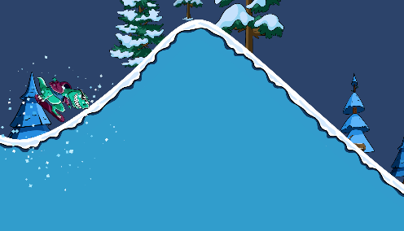

# SnowSurfer

A simple 2D snowboarding game made with Unity and C#. Ride down snowy hills, perform flips, and reach the finish line. Crashes and finishes trigger particle effects and restart the level.

Open the project in Unity **6000.6.0f1**, load `Assets/Scenes/Level1.unity`, and press **Play**.

Hold **W / Up Arrow** to boost while touching the snow.

Snow particle effects:

